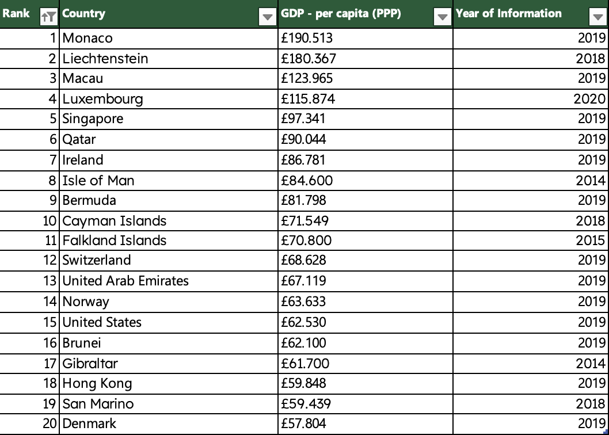
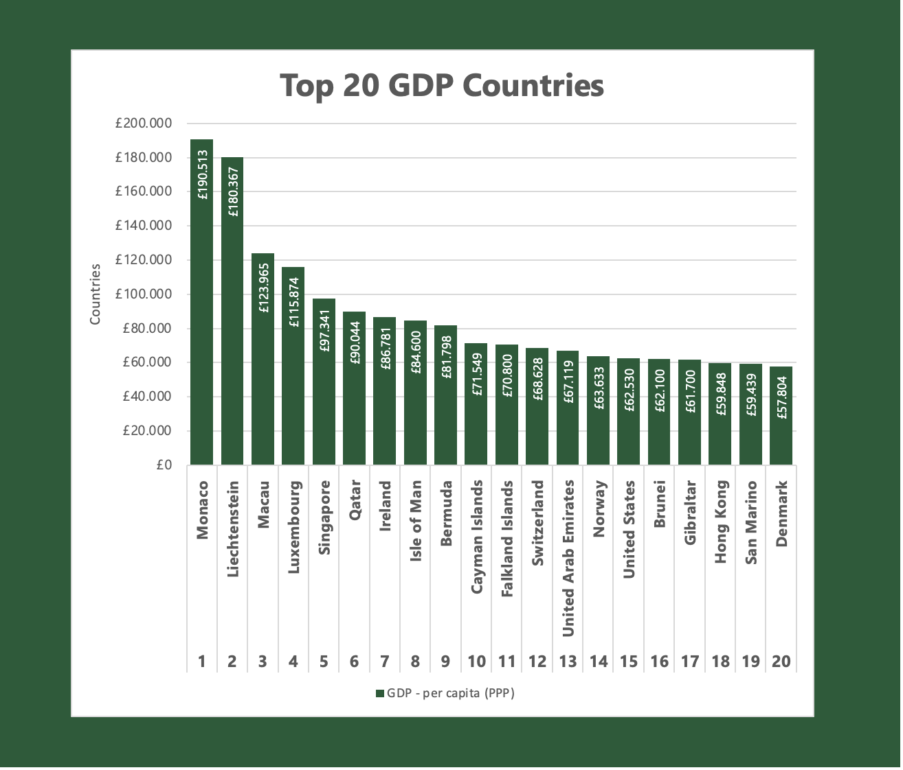
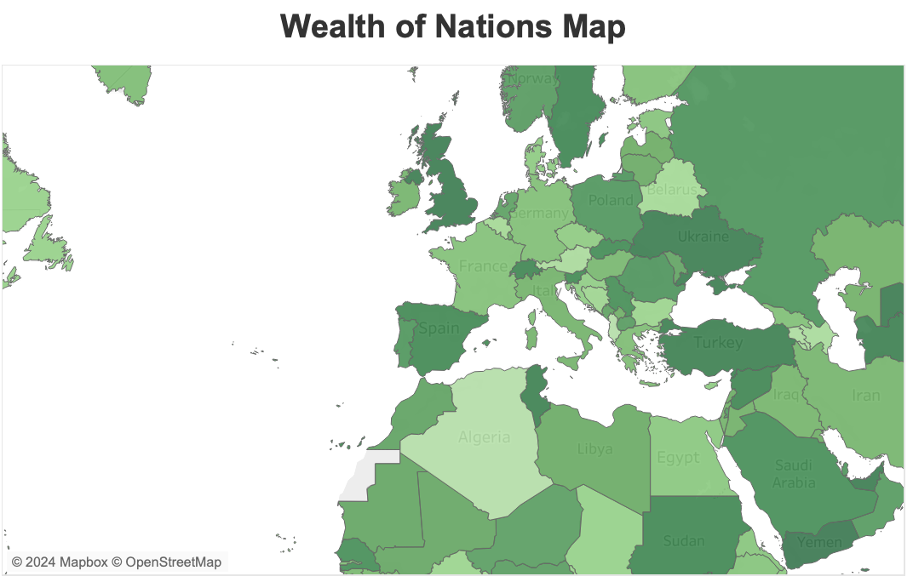
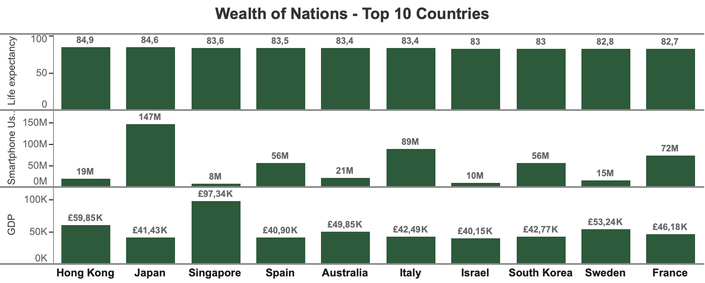
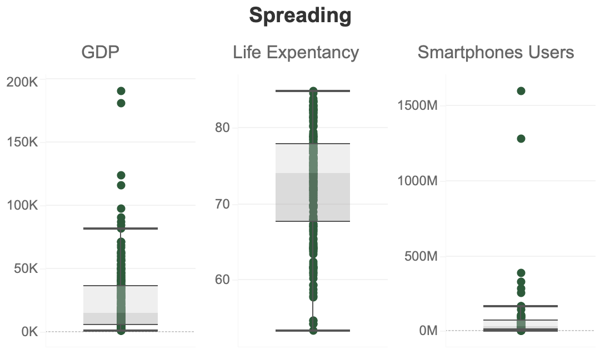
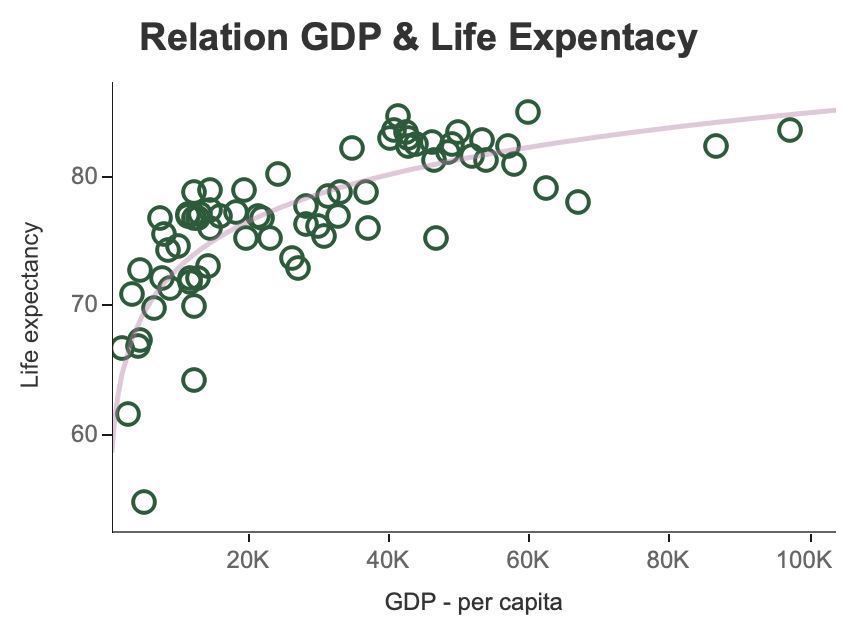
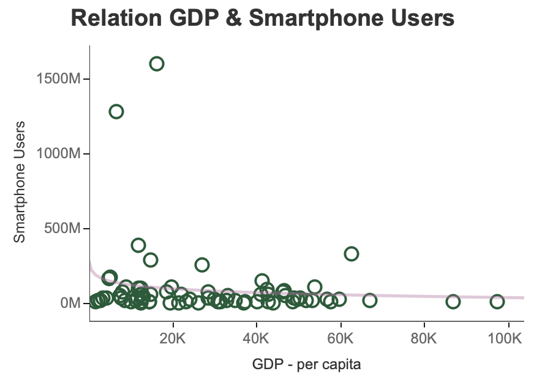

# Wealth of Nations Dataset Analysis

### Project Overview
This project focuses on analyzing the Wealth of Nations dataset. It involves a comprehensive process of data cleaning, sorting, and filtering using Excel. This README provides an overview of the methodologies used, the tools involved, and the insights derived from the dataset.

### Dataset

#### Attribute Information:
**GDP**

*Rank:* Numeric. The position of a country relative to all others based on GDP.

*Country:* String. The name of the country being referred to. 

*GDP - per capita (PPP):* Numeric Currency.The GDP per capita in pounds sterling (£), representing the economic output per person.

*Year of Information:* Numeric. Year in which the GDP data was collected.

**Life Expectancy**

*Rank:* Numeric. The position of a country relative to all others based on the number of smartphone users.

*Country:* String. The name of the country being referred to. 

*Life Expectancy at birth:* Numeric. The average number of years a newborn is expected to live under current mortality rates.

*Date of Information:* Numeric. The year in which the life expectancy data was collected.

**Smartphones**

*Rank:* Numeric. The position of a country relative to all others based on the number of smartphone users.

*Country:* String. The name of the country being referred to.

*Smartphone Users:* Numeric. The total number of smartphone users in the country.

*Year of Information:* Numeric. The year in which the smartphone user data was collected.

### Features
#### Data Cleaning and Management in Excel
The dataset was initially processed in Excel where it underwent cleaning, sorting, and filtering. This step was crucial for ensuring data quality and usability.

#### Security 
To ensure data integrity and confidentiality, the Excel workbook was protected with a password.

#### Data Visualization and Analysis
Advanced data visualization techniques were applied using Tableau. This helped in extracting meaningful insights from the dataset.

#### Accessibility 
All visualizations were designed considering color blindness, ensuring accessibility to a wider audience.

#### Visualizations Created
*Excel: Filtered Data and Plot*

*Tableau: Plots*

### Tools Used
Microsoft Excel: For initial data cleaning, sorting, filtering, and chart/table creation.

Tableau: For creating advanced data visualizations.

### Contribution Guidelines
Contributions are welcome! Please adhere to this project's code of conduct.

### Contact Information
For support or queries, reach out to me at [my email address](mailto:albertevieites@gmail.com).

### Acknowledgements
Special thanks to [Yusuf Satilmis](https://github.com/yusufsjustit) for their invaluable assistance in this project.