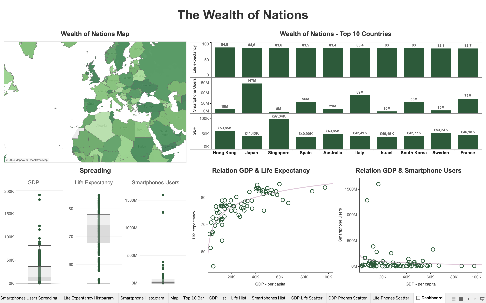

# Wealth of Nations Dataset Analysis

## Project Overview
This project focuses on analyzing the "Wealth of Nations" dataset, involving a comprehensive process of data cleaning, sorting, and filtering using Excel. In addition to these methodologies, we have enhanced our analysis with the creation of detailed charts in Excel and an interactive dashboard in Tableau. These visualizations provide a deeper understanding of the dataset’s insights, showcasing economic trends and socio-economic indicators across nations.

The Excel charts illuminate key patterns, while the Tableau dashboard offers a dynamic exploration tool, enabling users to filter and visualize data interactively. This approach not only deepens the analytical depth but also makes our findings more accessible to a broader audience.

For more detailed information on our methodologies, tools, and insights, please refer to this README.

## Dataset

### Attribute Information:
**GDP**

| Column Name            | Data Type | Description                                          |
|------------------------|-----------|------------------------------------------------------|
| Rank                   | Numeric   | The position of a country relative to all others based on GDP. |
| Country                | String    | The name of the country being referred to.           |
| GDP - per capita (PPP) | Numeric Currency | The GDP per capita in pounds sterling (£), representing the economic output per person. |
| Year of Information    | Numeric   | Year in which the GDP data was collected.            |

***

**Life Expectancy**

| Column Name            | Data Type | Description                                          |
|------------------------|-----------|------------------------------------------------------|
| Rank                   | Numeric   | The position of a country relative to all others based on life expectancy. |
| Country                | String    | The name of the country being referred to.           |
| Life Expectancy at Birth | Numeric  | The average number of years a newborn is expected to live under current mortality rates. |
| Date of Information    | Numeric   | The year in which the life expectancy data was collected. |

***

**Smartphones**

| Column Name            | Data Type | Description                                          |
|------------------------|-----------|------------------------------------------------------|
| Rank                   | Numeric   | The position of a country relative to all others based on the number of smartphone users. |
| Country                | String    | The name of the country being referred to.           |
| Smartphone Users       | Numeric   | The total number of smartphone users in the country. |
| Year of Information    | Numeric   | The year in which the smartphone user data was collected. |

## Features
### Data Cleaning and Management in Excel
The dataset was initially processed in Excel where it underwent cleaning, sorting, and filtering. This step was crucial for ensuring data quality and usability.

### Security 
To ensure data integrity and confidentiality, the Excel workbook was protected with a password.

### Data Visualization and Analysis
Advanced data visualization techniques were applied using Tableau. This helped in extracting meaningful insights from the dataset.

### Accessibility 
All visualizations were designed considering color blindness, ensuring accessibility to a wider audience.

### Visualizations Created
*Excel*

| Table                                          | Chart                                |
|------------------------------------------------|--------------------------------------|
|  |  |

  

*Tableau*

## Tools Used
Microsoft Excel: For initial data cleaning, sorting, filtering, and chart/table creation.

Tableau: For creating advanced data visualizations.

## Contribution Guidelines
Contributions are welcome! Please adhere to this project's code of conduct.

## Contact Information
For support or queries, reach out to me at [my email address](mailto:albertevieites@gmail.com).

## Acknowledgements
Special thanks to [Yusuf Satilmis](https://github.com/yusufsjustit) for his invaluable assistance in this project.